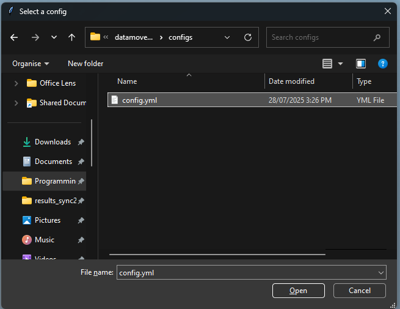

# SCP Wrap

SCP wrap was written to upload data from a shared instrument PC to your own market or vault share. It uses OIDC authentication and SSH certificates to differentiate between users and give access to your share without compromising your data to other users of the instrument PC. In this way you will no longer need to directly mount your market or vault to a shared PC where you can forget to disconnect it compromising your data.


## User Dependencies
- A google account mapped to a user on the sshauthz server
- A [market](https://docs.erc.monash.edu/RDS/UserGuides/MarketStorageUserGuide/) and/or [vault](https://docs.erc.monash.edu/RDS/UserGuides/VaultStorageUserGuide/) share to move data to - if you don't have one you will need to apply for one
- A [market](https://docs.erc.monash.edu/RDS/UserGuides/MarketStorageUserGuide/) and/or [vault](https://docs.erc.monash.edu/RDS/UserGuides/VaultStorageUserGuide/) share mapped on the Data Transfer Gateway

## Installation

### Global Installation (Production)
Use this if your computer is locked down and has running scripts disabled.
1. Install Python from the Microsoft Store
2. `pip install paramiko pyyaml speedtest-cli`
3. Create an installation folder and copy `scpwrap.py` to the installation folder
4. Configure the computer to launch python scripts using the Python version you just installed

### Virtual Environment Installation (Development)
Use this if you have more control over your computer or if you're a developer
1. In the script's working directory: `python3 -m venv .venv`
2. Activate the environment with:  
   1. Unix: `source .venv/bin/activate`  
   2. Windows: `.venv/Scripts/activate`
3. `pip install -r requirements.txt`

## Instructions
0. Activate the virtual environment if you are using one
1. Double click on `scpwrap.py` or run the script in the command line
2. Select your config. It should be in the following format:
   ```
   localbase: '{The drive your data is stored on}'
   remotebase: '{The remote server path you want your data moved to}'
   remote_host: sshauthz.globus-development.cloud.edu.au
   sshauthz: https://sshauthz.globus-development.cloud.edu.au/?ca=ca
   ```
   Example:
   ```
   localbase: 'F:/'
   remotebase: 'name-of-your-market/example-folder'
   remote_host: sshauthz.globus-development.cloud.edu.au
   sshauthz: https://sshauthz.globus-development.cloud.edu.au/?ca=ca
   ```
   Note that this folder should exist before you start moving  
   
3. Select a folder to move  
   
5. Confirm if you are deleting the dataset after moving  
   
7. Authenticate with your Google account (your Monash details) in the popup web browser  
     
8. Save your certificate  
   
9.  Close the web browser
10. Leave the process running as it moves your data
11. Press ENTER to exit